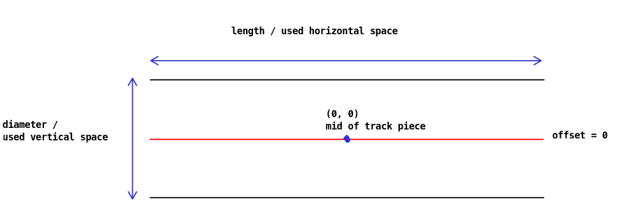
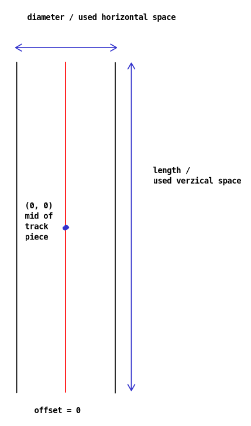
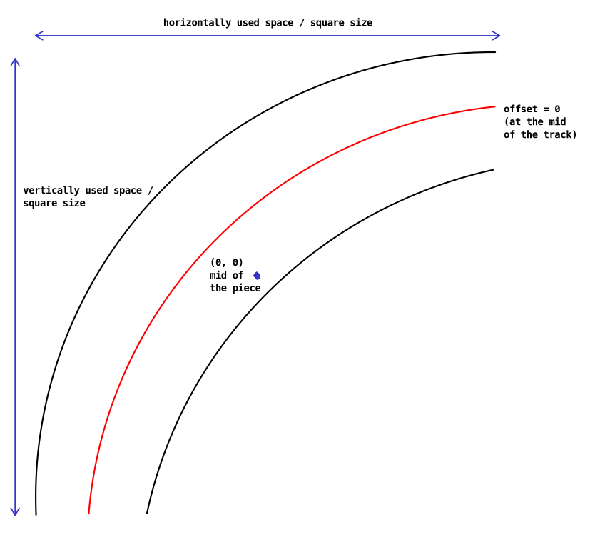

# Location Service (Simulation)
The location service works by simulating the car movement. It includes simulation for acceleration and lane changes.

## General working
The simulation works by having a track. This track consists of multiple Trackpieces that are on known "global" positions
on the FullTrack (determined while building the track). With the sum of the position of the car on the current piece and
the Trackpiece position on the track itself you can get the global position. On a track the upper left corner of the
upper left piece is on (0, 0).

## Coordinate system
North means that the y value is **decreasing**. East means the x value is **increasing**.

## Pieces
The coordinate (0, 0) of every piece is in the middle of it. To see the common variable names look at the following
pictures:

Straight Piece (Horizontal):

Straight Piece (Vertical):

Curved Piece:

## Inner workings / Simulation Step
The simulation works by having actual values for speed/offset and target values. Every step these values first are
adjusted according to the target. After that the car uses a function of the track piece to get either it's new position
on the track piece **OR** how much distance it has left to travel. If it has distance left to travel it means it reached
the end of the piece and should immediately (in the same step) go to the next track piece.

These calculations are called usually multiple times per second (according to how often the position should be updated).
The amount of updates is configurable.

## Offset
The track pieces have a offset that is absolute (as in it doesn't know the driving direction and therefor isn't making
positive values go right). To implement the offset to be dependent on the driving direction the value is adjusted before
giving it to the track in the LocationService implementation that knows the full track.
