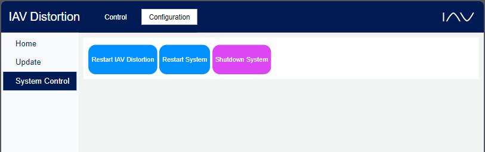
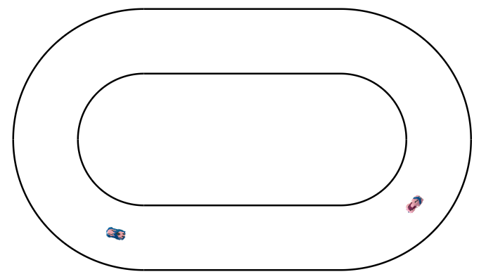

# IAV-Distortion
## About the project
The IAV-Distortion project is an interactive and educational showcase designed to demonstrate the need of automotive cybersecurity in a playful, engaging manner.
This project leverages the fun experience of the Anki Overdrive race track, but with an added twist - your car can be hacked.
Our primary objective is to highlight the potential impacts of hacking attacks on vehicles, an increasingly relevant issue as technology becomes more integrated into the automotive industry.


The IAV-Distortion project is an ideal exhibit for trade fairs or other similar events, attracting attendees with its unique blend of technology and entertainment. 
It thereby acts as a crowd-puller due to its exciting premise and the opportunity it offers for audience interaction.
Through this initiative, we aspire to make the sometimes daunting world of cybersecurity accessible to a wider audience, fostering understanding and engagement.


## Getting Started
### Prerequisites
To run this project you will need at least an Anki Overdrive starter kit (vehicles and racetrack).
The project is developed to run on a Raspberry Pi 5 (8GB) running Raspberry OS.
But it can also be run on a windows machine (will require some different dependencies).

The installation as described below will require internet connection.
Afterwards the project doesn't need an internet connection when running.
Only if you want to get an update.

### Installation on a Raspberry Pi
> [!IMPORTANT]
> Raspberry OS has to be installed already.
> Information on [how to install Raspberry OS](https://www.raspberrypi.com/software/) can be found on the official Raspberry Pi website.

1. Download the [installer.sh](installer.sh) script.
2. Make the installer.sh script executable using the following command and run it afterwards in the terminal (double click -> run in terminal).
```
sudo chmod +x <path/to/>installer.sh
```

> [!NOTE]
> During the installation process the following will happen:
> 1. Search for existing local copies of the repository/folders with the repository name "IAV_Distortion".
>   - if **exactly one** folder was found (for example an older installation), you will be asked if you want to use this folder for the installation. This will delete everything in the folder.
>   - if **more than one** folder was found, you will get a warning to make sure to only run one instance of IAV Distrotion at a time.
>   - if **no** folder was found, you will be asked where you want to install IAV Distortion. Type in the desired path or leave empty to install in the current path.
> 2. Afterwards you will be asked if you want to clone a certain branch from the repository. Leave it empty to install the newest version from the **master** branch.
> 3. Then you will be asked if you want to run the install script. Type **y** to run the script (otherwise the process will stop here and you only cloned the repository)
>   Running the install script will:
>   - install the virtual python environment (pipenv)
>   - download further additional resources (like javascript libraries) to a dedicated directory to be able to run the project without internet connection
>   - create a desktop item
>   - make the desktop item executable
>   - add to autostart as a cronjob (recommended: optionally: you will be asked if you want to)


## Usage
After setting up the project successfully, you can control the system and the cars using any device wich can access a webbrowser and is connected to the same network or hotspot of the system.

> [!TIP]
> A guide on how to set up your raspberry pi as a hotspot to run IAV Distortion as a stand-alone system can be found [here](doc/Setting%20up%20IAV%20Distortion%20as%20a%20stand-alone%20system).

### Staff Control
The staff userinterface can be accessed via [&lt;system_iP&gt;:5000/staff/staff_control]().
On this side Anki cars can be added / connected via bluetooth.
Also virtual vehicles can be added.
All vehicles and player in the game (or in the queue) are displayed in the 'List of Players/Cars'.
The list shows which player controls which vehicle. If one of the fields is none a vehicle is free to be used or a player is waiting to be assigned to a free vehicle.
Aside from that the different hacking scenarios can be activated for the cars assigned to a player.
Therefore chose the scenario for the car you want to apply the effect to, as soon as scenario is preselected the 'Set Scenario' button becomes active and can be used to apply the effect to the vehicle.


Additional to the controls for the game itself, some system configurations and functions can be accessed by switching to the 'Configuration' tab.
Here the system can be updated to the latest version available in the repository (of the installed branch) or functions like restarting IAV Distortion, the whole system (Raspberry Pi) or shutting down the system can be accessed.

> [!IMPORTANT]
> - These functions (Update, Restart IAV Distortion, Restart System and Shutdown System) are only available on Unix like systems.
> - Running an update requires internet connection.



### Driver UI
The driver ui can be accessed via [&lt;system_iP&gt;:5000/driver]().
The player will automatically be sent to a waiting queue.
As soon as a vehicle is free (not assigned to any other player), the player will be assigned to the vehicle and the controls are granted.
The slider on the left controls the speed.
With the buttons on the right the lanes can be changed or a u-turn can be performed.
Player controlling a virtual car will get a top down view of the controlled vehicle (as displayed on the [virtual track](#Virtual-Racetrack)).


> [!NOTE]
> To performe a lane change or a u-turn the slider as to be released.

> [!NOTE]
> There are different mechanisms to prevent inactive player to remain in the game and block active player from getting the vehicles.
> These are a heartbeat check for the clients to remove them after unexpected disconnects and a detection if a player has the ui opened in the foreground.
> If a player leaves the driver ui for to long, he will be removed from the game and player queue.
> The player can reconnect to the game but will be placed at the end of the queue.
> 
> These mechanisms have configurable parameters.
> Please refer to the [documentation of configuration parameters](/doc/Configuration).

### Virtual Racetrack
The virtual car can be controlled on a virtual racetrack.
It is planned to display the real cars on the virtual track as well.
The virtual racetrack can be accessed via [&lt;system_iP&gt;:5000/car_map]().
There the (currently hardcoded) racetrack with the virtual cars is shown.



<!--## Roadmap

## Contributing
-->

## License
### Third party dependencies
IAV-Distortion uses some third party dependencies.
- Bleak (MIT License)
- Quart (MIT License)
- python-socketio (MIT License)
- hypercorn (MIT License)
- pytest (MIT License)
- pytest-asyncio (Apache License 2.0)
- pluggy (MIT License)
- sphinx (BSD2 License)
- jQuery (MIT License)
- cdnjs-socketio (MIT License)

<!-- ## Contact
-->
