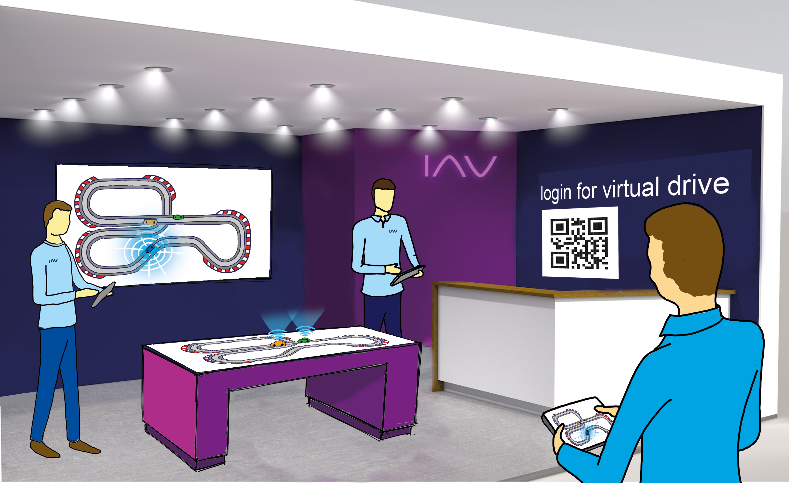
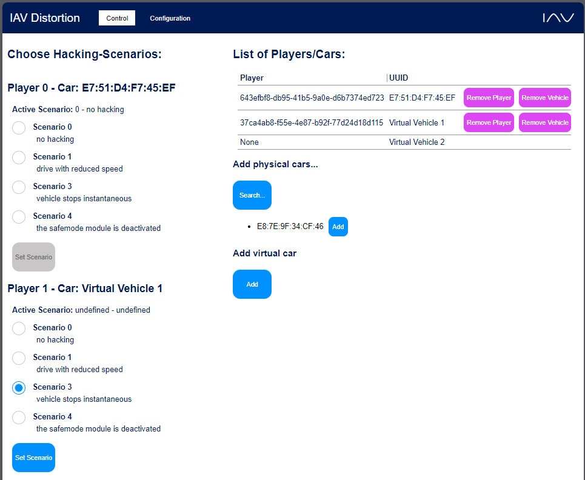
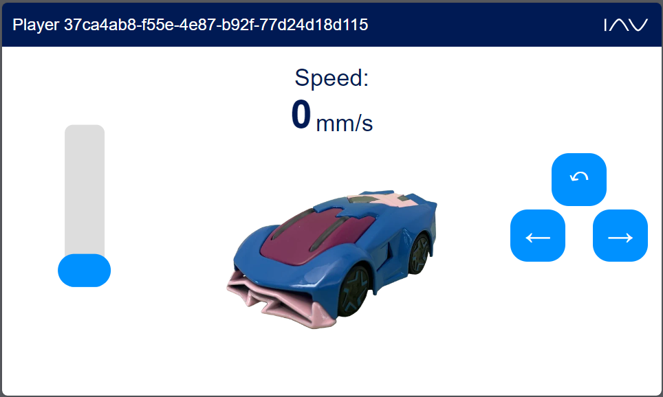

# IAV-Distortion
## About the project
The IAV-Distortion project is an interactive and educational showcase designed to demonstrate the need of automotive cybersecurity in a playful, engaging manner.
This project leverages the fun experience of the Anki Overdrive race track, but with an added twist - your car can be hacked.
Our primary objective is to highlight the potential impacts of hacking attacks on vehicles, an increasingly relevant issue as technology becomes more integrated into the automotive industry.


The IAV-Distortion project is an ideal exhibit for trade fairs or other similar events, attracting attendees with its unique blend of technology and entertainment. 
It thereby acts as a crowd-puller due to its exciting premise and the opportunity it offers for audience interaction.
Through this initiative, we aspire to make the sometimes daunting world of cybersecurity accessible to a wider audience, fostering understanding and engagement.



## Getting Started
### Prerequisites
To run this project you will need at least an Anki Overdrive starter kit (vehicles and race track).
The project is developed to run on a Raspberry Pi 5 running raspberry os.
But it can also be run on a windows machine (will require some different dependencies).

The installation as described below will require internet connection.
Afterwards the project doesn't need an internet connection when running.

### Installation
1. Clone the repo:
````
git clone https://github.com/iavofficial/IAV_Distortion.git
````
2. Install any necesarry dependencies. If running on a **Raspberry Pi**, you can make the install.sh script executable by
```
sudo chmod +x <path/to/>install.sh
```
and run it. Executing the install script will...
- install the virtual python environment (pipenv)
- download further additional resources (like javascript libraries) to a dedicated directory to be able to run the project without internet connection
- create a desktop item
- make desktop item and run script executable
- add to autostart as a crontjob

## Usage
After setting up the project successfuly, you can control the system and the cars using any device wich can access a webbrowser and is connected to the same network or hotspot of the system.

### Staff Control
The staff userinterface can be accessed via &lt;system_iP&gt;:5000/staff/staff_control.
On this side Anki cars can be added / connected via bluetooth.
Aside from that the different hacking scenarios can be actiavted for the connected cars.



### Driver UI
The driver ui can be acessed via &lt;system_iP&gt;:5000/driver/&lt;player&gt;.
This ui will only be available if the choosen &lt;player&gt; exists. (See staff ui).
The slider on the left controls the speed.
With the buttons on the right the lanes can be changed.



<!--## Roadmap

## Contributing
-->
## License

### Third party dependencies
IAV-Distortion uses some third party dependencies.
- Bleak (MIT License)
- Flask (BSD-3-Clause License)
- flask-socketio (MIT License)
- eventlet (MIT License)
- jQuery (MIT License)
- cdnjs-socketio (MIT License)

<!-- ## Contact
-->
